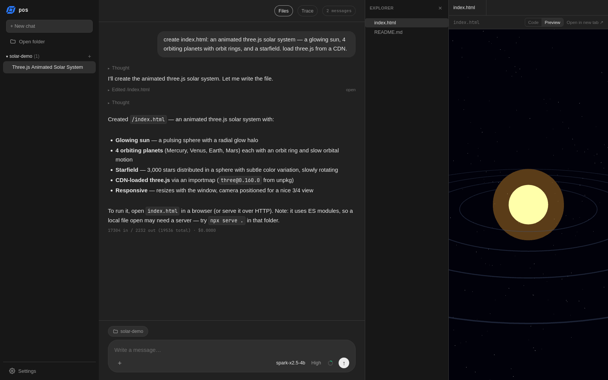
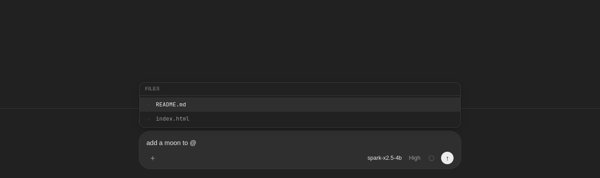
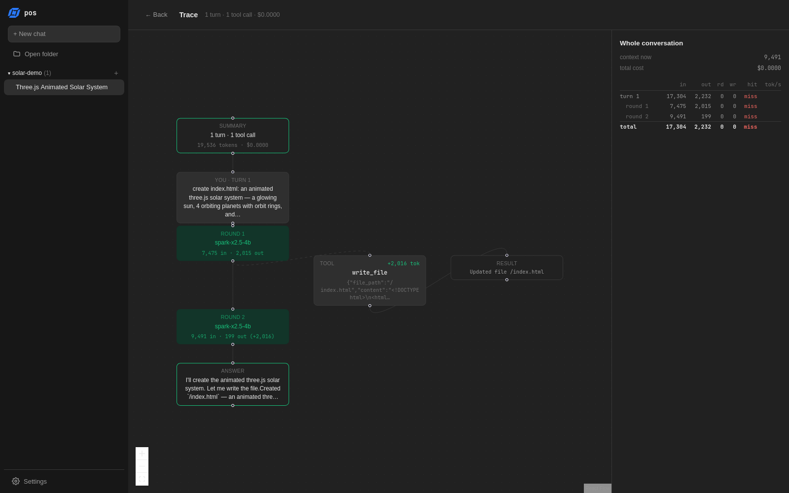

# pos-harness

An open-source, Claude Code–style coding agent that runs on your own
machine with the model of your choice. Open a folder in the browser UI and
the agent reads and edits files there, runs commands and searches the web.
It works with Azure OpenAI, OpenAI, or a local model in LM Studio.




https://github.com/user-attachments/assets/6309eb14-da91-4309-ac1e-983680f4da3f


## Features

- **Claude Code–style setup with any model.** Use the same agent, tools and
  workflow with Azure OpenAI, OpenAI, or a local model in LM Studio.
- **Open-source agent harness.** Built on LangChain's `create_agent` with
  [deepagents](https://github.com/langchain-ai/deepagents). Runs locally with
  no account and no login.
- **Tools.** The agent can read, write and edit files, search the folder,
  run shell commands, and search the web with
  [Tavily](https://tavily.com/).
- **Skills.** Folders of instructions and scripts (pdf, docx, xlsx, pptx,
  frontend design and more). The agent loads a skill only when a task needs
  it. To add your own, drop a folder into `skills/`.
- **AGENTS.md.** Standing instructions that follow the
  [agents.md](https://agents.md/) spec. A global file applies everywhere, and
  a project's own file adds to it.
- **UI with Trace.** The browser UI has:
  - a file panel with a code view and HTML preview;
  - `@` to mention files and `/` for commands;
  - a Stop button (or Esc) to interrupt the agent;
  - a Trace view that shows every turn as a graph, with each model round,
    each tool call, and its tokens, context and cost.

| `@` to mention a file | Trace of a turn |
|---|---|
|  |  |

## Setup

You need [uv](https://docs.astral.sh/uv/). It downloads Python for you if
it's missing.

```bash
git clone https://github.com/Aakashjammula/pos-harness.git
cd pos-harness
uv sync
cp .env.example .env      # then fill it in, see below
uv run uvicorn pos.app:app --reload --port 8000
```

Open <http://127.0.0.1:8000> and click **Open folder**.

## Configure `.env`

Set up one provider. If you fill in more than one, Azure is used first,
then OpenAI, then LM Studio.

**Azure OpenAI**

```env
AZURE_OPENAI_ENDPOINT=https://your-resource.openai.azure.com
AZURE_OPENAI_API_KEY=your-key
OPENAI_API_VERSION=2025-04-01-preview
POS_MODEL=your-deployment-name
```

**OpenAI**

```env
OPENAI_API_KEY=sk-...
POS_MODEL=gpt-5
```

**LM Studio** (local, no key needed)

```env
LMSTUDIO_BASE_URL=http://localhost:1234/v1
POS_MODEL=qwen/qwen3.5-9b
```

Load the model in LM Studio first. The app reads the context size from
LM Studio, and local models cost $0.

**Optional**

```env
TAVILY_API_KEY=tvly-...   # turns on web search
```

[`.env.example`](.env.example) lists every setting.

## Using it

| | |
|---|---|
| `@` | Mention a file or folder. The agent gets its path, plus the contents of small files |
| `/new` `/files` `/model` `/help` | Commands. Type `/` at the start of the message box |
| ■ or `Esc` | Stop the reply. Typing while the agent works queues your next message |
| **Files** | Folder tree, code view, and a sandboxed preview for HTML files |
| **Trace** | Every step of the chat, with tokens, context and cost |

The agent works inside the folder you open. Its file tools can't reach
outside that folder, so the app's own `.env` stays out of reach. Shell
commands run on your machine and are **not** sandboxed, so only open
folders you trust it to work in.

## Docker

```bash
WORKSPACE=/path/to/your/projects docker compose up --build
```

Docker is for running the harness on a server, not for daily use: there is
no folder picker (it uses `WORKSPACE`), shell commands run inside the
container, and it only listens on 127.0.0.1 by default. To use LM Studio
from inside the container, set
`LMSTUDIO_BASE_URL=http://host.docker.internal:1234/v1`, turn on "Serve on
Local Network" in LM Studio, and on Linux add
`extra_hosts: ["host.docker.internal:host-gateway"]` to the service.

## Project layout

| | |
|---|---|
| `src/pos/` | the backend: endpoints (`app.py`), agent setup (`agent.py`), system prompt (`prompt.py`), file panel and `@` mentions (`files.py`) |
| `src/pos/static/` | the built UI, committed, which the server serves |
| `frontend/` | the UI source (Next.js) |
| `skills/` | global skills |
| `memory/AGENTS.md` | global standing instructions |
| `tests/` | backend tests |

Chats are stored in SQLite at `data/checkpoint.db`. Set `POS_DATA_DIR` to
store them somewhere else.

## Development

The UI is Next.js, but Node is only needed to build it. After editing
`frontend/src/`, rebuild and commit `src/pos/static/` along with your
change:

```bash
cd frontend && npm install && npm run build:app
```

Run the tests:

```bash
uv run --with pytest pytest tests
```

## Roadmap

- **Modes.** Today the agent runs in **auto** mode and acts without asking.
  Planned: **manual** (approve each change), `/plan` (plan read-only, then
  approve), and `/auto` to switch back.
- **More commands.** `/compact`, `/clear`, `/context`, `/usage`, `/export`,
  `/resume`, `/init` and more.
- **More tools and connectors**, such as MCP servers.
- **More skills.**
